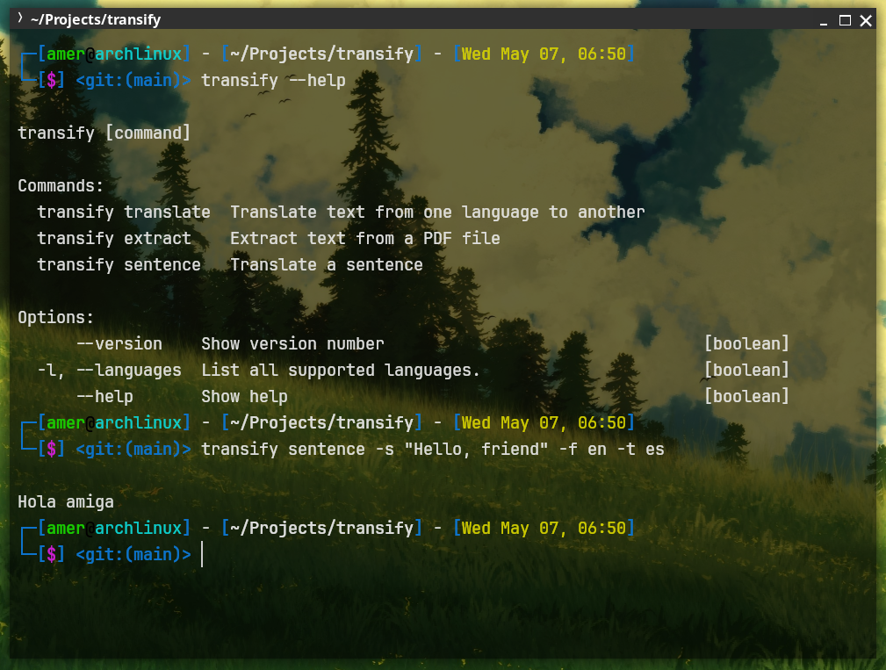

# Transify

A NodeJS CLI tool to extract text from PDFs and translate between languages.


## Features

- **PDF Text Extraction** - text extraction from PDF files
- **Multi-language Translation** - Supports 4+ languages (expandable)
- **Sentence-level Translation** - Quick single-sentence translations

## Installation

### Via npm (Recommended)
```bash
npm install -g transify
```

## Manual Installation
```bash
git clone https://github.com/yourusername/transify.git
cd transify
npm install
npm link  # for global access
```

## Quick Start
### 1. languages code 
```bash
transify -languages
```

### 2. sentence translation:
```bash
transify sentence -s "hello" -f en -t es
```

### 3. Extract text only:
```bash
transify extract -p "PDF file path"
```

### 4. Translate a PDF:
```bash
transify translate -p "PDF file path" -f en -t es
```

## Full Usage

### Commands

| Command       | Description                          | Example                              |
|---------------|--------------------------------------|--------------------------------------|
| `translate`   | Translate a PDF file                 | `transify translate -p file.pdf -f en -t es` |
| `extract`     | Extract text from PDF                | `transify extract -p doc.pdf`        |
| `sentence`    | Translate single sentence            | `transify sentence -s "Text" -f en -t de` |
| `--languages` | Show supported languages             | `transify -l`                        |

### Options

| Flag               | Description                     | Required For        |
|--------------------|---------------------------------|---------------------|
| `-p`, `--path`     | Path to PDF file                | All commands except `-l` |
| `-f`, `--from`     | Source language code            | `translate`, `sentence` |
| `-t`, `--to`       | Target language code            | `translate`, `sentence` |
| `-s`, `--sentence` | Text to translate               | `sentence` command only |
| `-l`, `--languages`| List supported languages        | Standalone flag      |

## Supported Languages

| Language | Code |
|----------|------|
| English  | en   |
| Spanish  | es   |
| German   | de   |
| Arabic   | ar   |
